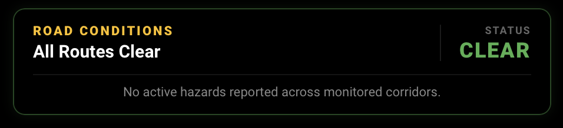

# The 511

[](https://github.com/hacs/integration)
[](https://www.home-assistant.io/)
[](https://github.com/ihavespoken327/ha-the511/releases)
[](https://opensource.org/licenses/MIT)

A Home Assistant custom integration for traffic cameras, road conditions,
incidents, weather stations, travel times, and message signs from North
American 511 systems.

**Domain:** `the511` · **Display name:** The 511 · **Subtitle:** Traffic
Cameras & Road Conditions

## Features

- **Traffic cameras** — still snapshots of DOT camera feeds, refreshed on demand
- **Incidents** — crashes, closures, and hazards as `binary_sensor` + map markers
- **Road conditions** — surface status per roadway (wet, snow, ice, ...)
- **Weather stations** — air temperature, humidity, dewpoint, wind
- **Travel times** — measured route estimates with delay
- **Message signs** — the live text currently on dynamic message signs
- **Multi-provider** — 20+ US states and Canadian provinces on a shared plugin base

> [!WARNING]
> Work in progress. Cameras, incidents, road conditions, weather stations,
> travel times, dynamic message signs, incident map markers, multi-provider
> support, and entity bounds are all implemented. Providers are available for
> Wisconsin, Louisiana, Alaska, New York, Georgia, Arizona, Connecticut,
> Florida, Idaho, Nevada, and Utah, plus the Canadian provinces Alberta,
> Ontario, Newfoundland & Labrador, Manitoba, New Brunswick, Saskatchewan,
> and Nova Scotia, North Carolina, Pennsylvania, and Yukon, and the
> Iteris/ATG states South Carolina, Montana, and South Dakota (capabilities
> vary by provider). Most require the provider's own free 511 developer API
> key; Alberta, Ontario, and the Iteris/ATG states publish openly and need no
> key.

## Contributing

Want your state or province on here? Adding one is usually a ~25-line
provider file — fork, clone, branch, write, PR. See
[CONTRIBUTING.md](CONTRIBUTING.md) for the full walkthrough, or open an
[issue](https://github.com/ihavespoken327/ha-the511/issues) if your state's
511 system isn't listed and you'd like help adding it.

## Installation

**HACS** (recommended):

[](https://my.home-assistant.io/redirect/hacs_repository/?owner=ihavespoken327&repository=ha-the511&category=integration)

1. Click the button above, or in HACS open **⋯ → Custom repositories** and add `https://github.com/ihavespoken327/ha-the511` with category **Integration**.
2. Find **The 511** under **Integrations**, click **Download**, then **Restart** Home Assistant.
3. Once restarted, continue to [Setup](#setup) below.

**Manual:** copy the `custom_components/the511/` folder into your HA `config/custom_components/` directory and restart.

## Setup

1. Go to **Settings → Devices & Services → Add Integration** and search for **The 511**.
2. Pick your state or province from the provider list.
3. If the provider is keyed (see below), enter its developer API key when prompted. Open providers skip the credential step entirely.
4. After setup, open the integration's **Options** dialog to tune entity bounds (cameras, incidents, travel times, road conditions, message signs) and the incident search radius.

The integration polls each provider every **5 minutes** and updates entities from the latest feed. Cameras are still snapshots fetched on demand, refreshed from the same feed.

## Getting a developer API key

Keyed providers issue **their own** key from **their own** portal — a Wisconsin key won't work for New York. Keys are free; register a developer account on the provider's 511 site and it will issue you one. Paste it into the config flow.

| Provider | Developer portal |
|----------|------------------|
| Wisconsin | https://511wi.gov/developers/doc |
| Louisiana | https://511la.org/developers/doc |
| Alaska | https://511.alaska.gov/developers/doc |
| New York | https://511ny.org/developers/doc |
| Georgia | https://511ga.org/developers/doc |
| Arizona | https://az511.com/developers/doc |
| Connecticut | https://ctroads.org/developers/doc |
| Florida | https://fl511.com |
| Idaho | https://511.idaho.gov/developers/doc |
| Nevada | https://www.nvroads.com/developers/doc |
| Utah | https://www.udottraffic.utah.gov/developers/doc (throttled to 10 calls/min) |
| Newfoundland & Labrador | https://nl511.ca/developers/doc |
| Manitoba | https://www.manitoba511.ca/developers/doc |
| New Brunswick | https://511.gnb.ca/developers/doc |
| Saskatchewan | `prod-sk.ibi511.com` — no self-serve developer portal; key via the province's 511 program |
| Nova Scotia | `prod-ns.ibi511.com` — no self-serve developer portal; key via the province's 511 program |
| North Carolina | https://drivenc.gov |
| Pennsylvania | https://511pa.com |
| Yukon | https://511yukon.ca |

**No key needed** (open feeds): Alberta, Ontario, South Carolina, Montana, and South Dakota.

## Entity bounds (options flow)

Live 511 feeds can carry thousands of cameras, travel-time segments, and
incidents. Creating an entity for each one floods the entity registry and the
map, so The 511 bounds what it surfaces through the integration's **Options**
dialog (Settings > Devices & Services > The 511 > Options):

| Option | Default | Effect |
|--------|---------|--------|
| Maximum cameras | 25 | Keeps the `N` cameras nearest to home |
| Maximum incidents | 25 | Keeps the `N` incidents nearest to home |
| Incident search radius | 50 mi | Drops incidents farther than this from home |
| Maximum travel time routes | 25 | Keeps the `N` routes nearest to home |
| Maximum road conditions | 25 | Keeps the first `N` road conditions by road name |
| Maximum message signs | 25 | Keeps the `N` message signs nearest to home |
| Show planned roadwork | off | Planned construction events dominate the feed; hidden by default |

- Cameras, incidents, travel times, and message signs are ranked by
  straight-line distance from your HA home coordinates, nearest first.
- Road conditions carry no coordinates, so they are capped by road name
  (sorted) rather than by distance. Feeds that return several readings for
  one roadway are collapsed to a single road condition.
- Message signs report the sign's current text, which the provider may publish
  with markup (`<br>` etc.) stripped; only providers whose 511 feed actually
  serves sign text enable them (Montana's `dms` layer does; South Carolina's
  `dms` layer is VSL-only and stays disabled).
- Incidents without coordinates always surface (subject to the cap).
- Entity display names are capped at 100 characters so their `entity_id`s stay
  well inside HA's limit, even for long closure/detour titles.
- When an incident, route, or road condition leaves the selection it is
  removed from the entity registry, keeping the registry clean.

## Entities

Each provider creates the entity types its feed supports (see the capability
table). Sensors update every 5 minutes; cameras are snapshots fetched on
demand.

### Travel time sensor (`sensor.*`)

State is the current travel time in **minutes** (numeric, device class
*Duration*) — the DOT's measured estimate for that route segment.

Attributes: `road`, `normal_minutes`, `delay`, `distance`, `region`,
`start_latitude`, `start_longitude`, `end_latitude`, `end_longitude`.

### Message sign sensor (`sensor.*`)

State is the **full text currently displayed on the sign** (free text, HTML
stripped). It can be a travel time, a weather warning, or any other message
the DOT posts — it is never parsed into numbers.

Attributes: `road`, `direction`, `latitude`, `longitude`.

### Road condition sensor (`sensor.*`)

State is the surface status string (e.g. `Wet`, `Snow Covered`).

Attributes: `surface`, `pavement_temperature`, `air_temperature`,
`visibility`, `wind_speed`, `snow`, `ice`.

### Weather station sensor (`sensor.*`)

State is the air temperature (device class *Temperature*). The sensor reports
natively in **°C** and Home Assistant converts it to your configured unit
preference — °F on an imperial system, °C on metric.

Attributes: `humidity`, `dewpoint`, `wind`, `visibility`.

### Incident binary sensor (`binary_sensor.*`)

State is `on` while the incident is active, `off` otherwise (device class
*Problem*). Incidents with coordinates also surface as `geo_location` markers
on the map.

Attributes: `description`, `severity`, `event_type`, `road`, `latitude`,
`longitude`.

### Traffic camera (`camera.*`)

Still snapshots only — the entity fetches the latest image on demand, refreshed
from the same feed; there is no live stream.

Attributes: `road`, `direction`, `latitude`, `longitude`, `status`,
`video_url`.

## Dashboard

The 511 ships with a companion dark-themed dashboard built on Wisconsin
entities. It uses a handful of custom HACS cards; the three clips below
show it in action.

See **[docs/dashboard.md](docs/dashboard.md)** for the complete dashboard —
every card's full YAML, ready to copy.

### Required HACS frontend cards

Install these in HACS, then restart Home Assistant:

| Card | HACS repository | Used for |
|------|-----------------|----------|
| [button-card](https://github.com/romychab/lovelace-button-card) | `romychab/lovelace-button-card` | Road conditions, message signs, travel times |
| [swipe-card](https://github.com/rospogrigio/lovelace-swipe-card) | `rospogrigio/lovelace-swipe-card` | Camera and sign carousels |
| [auto-entities](https://github.com/thomasloven/lovelace-auto-entities) | `thomasloven/lovelace-auto-entities` | Current-delays list |
| [mushroom](https://github.com/piitaya/lovelace-mushroom) | `piitaya/lovelace-mushroom` | Section titles |
| [bubble-card](https://github.com/Clooos/Bubble-Card) | `Clooos/Bubble-Card` | Message-sign pop-up |
| [card-mod](https://github.com/thomasloven/lovelace-card-mod) | `thomasloven/lovelace-card-mod` | Styling |

### Full dashboard

<video controls src="https://github.com/user-attachments/assets/373147c2-7203-4fab-a264-63d77372fad0"></video>

The whole dashboard on a desktop browser — road conditions and the
status header up top, cameras, message signs, travel times, incidents and
their map below.

### Road conditions



A hazard-aware card. It scans every `sensor.the_511_*` road condition,
counts the roads that are affected, prints the worst surface status, and
glows the card border red/amber/green to match.

### Traffic cameras

<video controls src="https://github.com/user-attachments/assets/1bf3126e-b6d7-4f9a-af7e-ee8d0922c4fb"></video>

Camera carousel showing live snapshots from each configured camera.

### Message signs

<video controls src="https://github.com/user-attachments/assets/0fdc84b4-3292-4be3-9c12-6fdf10af549e"></video>

Dynamic message-sign cards; tapping a sign opens the full text in a pop-up.

## Providers

24 providers across two vendor platforms. Capabilities vary by what each
state/province actually publishes; `Key` means the provider needs the 511
system's free developer API key, `Open` means the feed is public and no key
is required.

> [!NOTE]
> **Not every provider has been confirmed against a live feed yet.** Each one
> is written to the vendor's documented API and covered by tests, but the
> feeds vary by state and can change. If a provider shows no entities after
> setup, your state may simply publish fewer feeds than the table suggests —
> open the integration's **Options** dialog and check the logs. If it looks
> like a genuine bug, please [open an issue](https://github.com/ihavespoken327/ha-the511/issues)
> so it can be fixed.

| Provider | Cameras | Incidents | Road conditions | Weather | Travel times | Message signs | Key |
|----------|:---:|:---:|:---:|:---:|:---:|:---:|:---:|
| Wisconsin | ✅ | ✅ | ✅ | | ✅ | | Key |
| Louisiana | ✅ | ✅ | | | ✅ | | Key |
| Alaska | ✅ | ✅ | ✅ | ✅ | | | Key |
| New York | ✅ | ✅ | ✅ | | | | Key |
| Georgia | ✅ | ✅ | | | | | Key |
| Arizona | ✅ | ✅ | | ✅ | | | Key |
| Connecticut | | ✅ | | | | | Key |
| Florida | ✅ | ✅ | | | | | Key |
| Idaho | ✅ | ✅ | ✅ | ✅ | | | Key |
| Nevada | ✅ | ✅ | ✅ | ✅ | | | Key |
| Utah | ✅ | ✅ | ✅ | ✅ | | | Key |
| Alberta | ✅ | ✅ | ✅ | ✅ | | | Open |
| Ontario | ✅ | ✅ | ✅ | | | | Open |
| Newfoundland & Labrador | ✅ | ✅ | ✅ | | | | Key |
| Manitoba | ✅ | ✅ | ✅ | | | | Key |
| New Brunswick | ✅ | ✅ | ✅ | | | | Key |
| Saskatchewan | ✅ | ✅ | | | | | Key |
| Nova Scotia | ✅ | ✅ | | | | | Key |
| North Carolina | ✅ | ✅ | | | | | Key |
| Pennsylvania | ✅ | ✅ | | | | | Key |
| Yukon | ✅ | ✅ | | | | | Key |
| South Carolina | ✅ | ✅ | | | | | Open |
| Montana | ✅ | ✅ | | | | ✅ | Open |
| South Dakota | ✅ | | | | | | Open |

## Architecture

```
Config Flow
    ↓
Config Entry
    ↓
DataUpdateCoordinator     ← the only object that talks to providers
    ↓
Provider (plugin)         ← e.g. WisconsinProvider
    ↓
Normalized Data Models    ← CameraData, IncidentData, ...
    ↓
Home Assistant Entities   ← cameras, sensors, binary_sensors, images
```

- **Config entries only** — no YAML configuration.
- **Fully async** — aiohttp + asyncio, no blocking I/O.
- **Provider plugin architecture** — each provider inherits `BaseProvider`,
  advertises capabilities (`supports_cameras`, `supports_incidents`, ...) and
  translates its native API into standardized models. Only supported entities
  are created. Two vendor platforms are implemented as shared bases:
  `TravelIQProvider` covers the Arcadis/IBI "GET" platform (Wisconsin,
  Louisiana, Alaska, New York, Georgia, Arizona, Connecticut, Florida,
  Idaho, Nevada, Utah, the seven Canadian provinces, North Carolina,
  Pennsylvania, and Yukon — each a thin subclass supplying its base URL,
  capabilities, and any provider-specific resource names, API versions,
  field aliases, or unit preferences; Alberta and Ontario omit the
  developer key and Alberta reports metric weather), and
  `IterisAtisProvider` covers the Iteris/ATG GeoJSON CDN (South Carolina,
  Montana, South Dakota — open layers, no key).
- **Entities never perform API calls** — they read from `coordinator.data`.

## Development

### Setup

```bash
uv venv
uv pip install -e ".[dev]"
```

### Checks

```bash
ruff check .
ruff format --check .
black --check custom_components tests
mypy custom_components
pytest
```

> `pytest` uses `pytest-homeassistant-custom-component`, so tests run against
> a real Home Assistant harness.

## Roadmap

| Phase | Scope | Status |
|-------|-------|--------|
| 1 | Bootstrap integration | ✅ |
| 2 | Provider framework | ✅ |
| 3 | Wisconsin provider | ✅ |
| 4 | Camera entities | ✅ |
| 5 | Incident entities | ✅ |
| 6 | Road condition sensors | ✅ |
| 7 | Weather stations | ✅ |
| 8 | Travel times | ✅ |
| 9 | Map support (`geo_location` incident markers) | ✅ |
| 10 | Multi-provider support | ✅ |
| 11 | Entity bounds + options flow | ✅ |
| 12 | Bound road condition sensors | ✅ |
| 13 | Multi-state providers (Travel-IQ base, Louisiana, Alaska) | ✅ |
| 14 | Eleven state providers on the Travel-IQ base (NY, GA, AZ, CT, FL, ID, NV, UT) | ✅ |
| 15 | Seven Canadian province providers on the Travel-IQ base (AB, ON, NL, MB, NB, SK, NS) | ✅ |
| 16 | North Carolina, Pennsylvania, and Yukon on the Travel-IQ base | ✅ |
| 17 | South Carolina, Montana, and South Dakota on a new Iteris/ATG GeoJSON base | ✅ |
| 18 | Road-condition dedupe fix (one sensor per road name) | ✅ |
| 19 | Dynamic message sign sensors (Montana `dms` layer) | ✅ |

## Troubleshooting / FAQ

**The integration isn't showing up in HACS after I added the repository.**
Make sure you added the repository with category **Integration** (not
Frontend) and restarted Home Assistant after clicking **Download**.

**I picked my state but got no entities.**
Capabilities vary by provider — not every 511 system publishes every feed.
Open the integration's **Options** dialog (Settings → Devices & Services →
The 511 → Options) to confirm the data source is reachable and, for keyed
providers, that your API key is valid. Providers you added with a bad key
silently surface nothing; check the logs for `the511` errors.

**Why do cameras only update on demand / look like stills?**
The 511 feeds publish periodic snapshots, not video streams. Each camera
entity is a snapshot fetched from the feed when HA requests an image.

**Temperatures show in °C but I want °F.**
The sensor reports natively in °C (device class *Temperature*); Home
Assistant converts it to the unit configured under **Settings → System →
General** (imperial = °F, metric = °C). No per-sensor setting needed.

**A camera/incident/route disappeared from the registry.**
Entity bounds (the Options dialog caps like *Maximum cameras*) drop entities
that leave the selection — a closed incident or a route that fell out of the
nearest-N window is removed to keep the registry clean. Raise the cap to keep
more of them around.

**I get a throttling/rate-limit error from the provider.**
Polls run every 5 minutes. Some providers (e.g. Utah, 10 calls/min) are
strictly throttled — a burst of entity updates can trip it. It recovers on
the next poll; if it persists, check the provider portal for your key's
quota.

**Do I need a key for my state?**
Only keyed providers (see the [developer key table](#getting-a-developer-api-key))
need one. Alberta, Ontario, South Carolina, Montana, and South Dakota publish
openly and skip the credential step entirely.

## License

MIT
