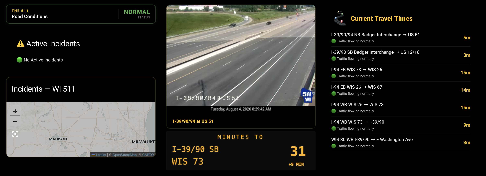
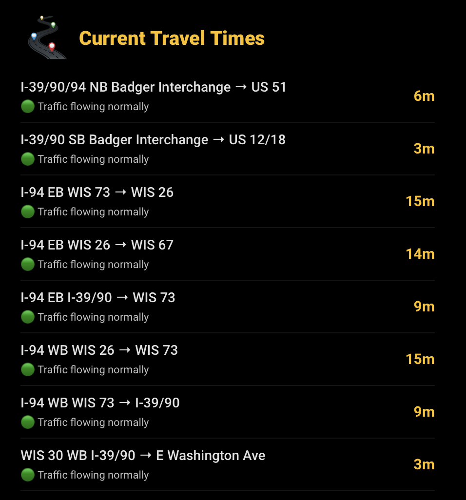
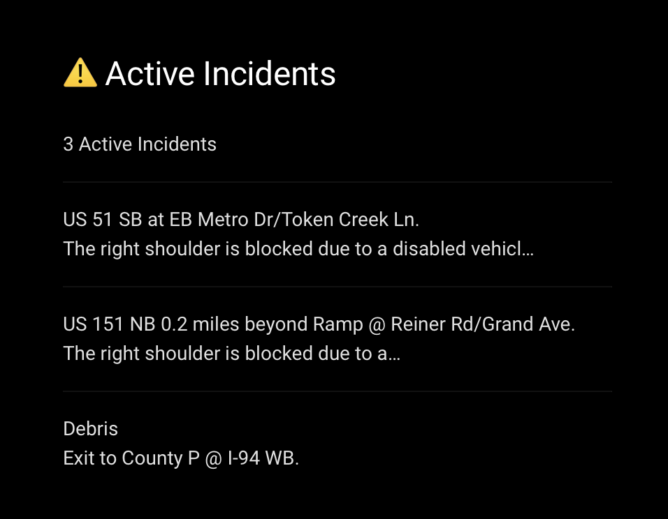
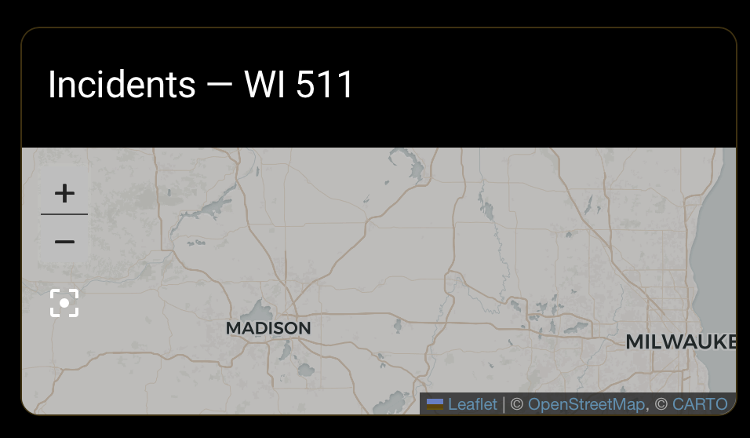

# The 511 — Card Reference

Per-card breakdown of the dashboard YAML in [`traffic.yaml`](traffic.yaml).

Each card below has its YAML, a screenshot (drop the matching `screenshots/*.png` next to it), and a short description.

## Prerequisites

Tested against HA 2026.7.4. Requires these HACS frontend cards: mushroom, button-card, auto-entities, layout-card, card-mod, mini-graph-card, text-divider-row.

## Full dashboard



<video controls src="screenshots/fulldash.mov"></video>

## 0. Shared templates — `button_card_templates`

**Description:** Shared card template block. `vms_sign_card` renders DMS message-sign text as a traffic-style board (route, destination, minutes, delay) with amber-on-black styling. Include this block (or merge it into an existing `button_card_templates` key) whenever you paste these cards into a YAML dashboard, so any template-based card renders.

<video controls src="screenshots/road_signs.mov"></video>

```yaml
button_card_templates:
  vms_sign_card:
    show_name: false
    show_state: false
    show_icon: false
    tap_action:
      action: more-info
    styles:
      card:
        - background: "#0c0c0c"
        - border: |-
            [[[
              return Number(entity.attributes.delay || 0) > 0 
                ? '3px solid #FFC107' 
                : '3px solid #6a6a6a';
            ]]]
        - border-radius: 3px
        - height: 120px
        - padding: 0
        - overflow: hidden
        - position: relative
      custom_fields:
        header:
          - position: absolute
          - top: 8px
          - left: 0
          - width: 100%
          - text-align: center
          - color: "#ffb300"
          - font-size: 17px
          - font-family: monospace
          - letter-spacing: 4px
          - text-shadow: 0 0 2px rgba(255,176,0,0.75)
        route:
          - position: absolute
          - top: 42px
          - left: 18px
          - color: "#ffb300"
          - font-size: 24px
          - font-family: monospace
          - text-shadow: 0 0 2px rgba(255,176,0,0.75)
        destination:
          - position: absolute
          - top: 78px
          - left: 18px
          - color: "#ffb300"
          - font-size: 27px
          - font-family: monospace
          - text-shadow: 0 0 2px rgba(255,176,0,0.75)
        minutes:
          - position: absolute
          - top: 42px
          - right: 30px
          - color: "#ffb300"
          - font-size: 40px
          - font-family: monospace
          - font-weight: bold
          - line-height: 1
          - text-align: right
          - text-shadow: 0 0 2px rgba(255,176,0,0.75)
        delay:
          - position: absolute
          - top: 95px
          - right: 20px
          - width: 80px
          - text-align: center
          - color: "#ff5252"
          - font-size: 13px
          - font-family: monospace
          - font-weight: bold
          - text-shadow: 0 0 2px rgba(255,82,82,0.75)
    custom_fields:
      header: |
        [[[ return "MINUTES TO"; ]]]
      route: |
        [[[
          const road = entity.attributes.road || "";
          const dirMatch = entity.attributes.friendly_name ? entity.attributes.friendly_name.match(/\b(EB|WB|NB|SB)\b/i) : null;
          const dir = dirMatch ? dirMatch[1].toUpperCase() : "";
          return `${road} ${dir}`.trim();
        ]]]
      destination: |
        [[[
          const match = entity.attributes.friendly_name ? entity.attributes.friendly_name.match(/to (.*)/i) : null;
          return match ? match[1].toUpperCase() : "";
        ]]]
      minutes: |
        [[[ return Math.round(Number(entity.state)); ]]]
      delay: |
        [[[
          const delay = Number(entity.attributes.delay || 0);
          if (delay <= 0) return "";
          return `+${delay} MIN`;
        ]]]
```

## 1. Hero

**Description:** Title banner for the dashboard. A primary-colour gradient wash with rounded corners and a muted tagline; sets the dark visual tone for the rest of the view.

```yaml
      - type: markdown
        content: |
          # The 511 — Live Traffic
          **Wisconsin roads · cameras · incidents**
        card_mod:
          style: |
            ha-card {
              background:
                linear-gradient(135deg, rgba(var(--rgb-primary-color), 0.20), rgba(0, 0, 0, 0) 55%),
                var(--ha-card-background);
              border: 1px solid rgba(var(--rgb-primary-color), 0.25);
              border-radius: 20px;
              padding: 4px 18px 10px 18px;
            }
            ha-card .markdown h1 {
              margin: 10px 0 0;
              font-size: 2rem;
              line-height: 1.1;
            }
            ha-card .markdown strong {
              color: var(--secondary-text-color);
              font-weight: 500;
            }
```

## 2. Status row

**Description:** Four at-a-glance cards: active incident count (turns red when any are on), number of roads not in `Normal` condition (amber when any), the current date/time, and the The 511 integration update card for release checks.

```yaml
      - type: custom:layout-card
        layout_type: grid
        columns:
          mobile: 2
          desktop: 4
        cards:
          - type: custom:mushroom-template-card
            primary: >-
              {{ (states.binary_sensor | selectattr('entity_id', 'search', 'the_511')
                 | selectattr('state', 'eq', 'on') | list | count) }}
            secondary: Active incidents
            icon: mdi:car-wrench
            color: >-
              
                red
              
                green
              
            tap_action:
              action: more-info

          - type: custom:mushroom-template-card
            primary: >-
              
              {{ (rc | selectattr('state', 'ne', 'Normal') | list | count) }}
            secondary: Roads impacted
            icon: mdi:highway
            color: >-
              
              
                amber
              
                green
              
            tap_action:
              action: more-info

          - type: custom:mushroom-template-card
            primary: "{{ now().strftime('%-I:%M %p') }}"
            secondary: "{{ now().strftime('%A, %b %-d') }}"
            icon: mdi:clock-outline
            color: amber

          - type: custom:mushroom-entity-card
            entity: update.the_511_update
            name: Integration
            icon: mdi:cloud-check-outline
            tap_action:
              action: more-info
```

## 3. Road Conditions — divider

**Description:** Section divider that labels the road-condition buttons below it.

```yaml
      - type: custom:text-divider-row
        text: Road Conditions
        style:
          divider-color: "rgba(var(--rgb-primary-color), 0.35)"
          text-color: "var(--secondary-text-color)"
          text-size: 13px
          margin: "14px 0 4px 0"
```

## 4. Road Conditions — grid


**Description:** Eight hand-picked highway condition buttons (I-39/90/94, I-94, I-90, I-894, US 12/18, US 12/14/18/151, US 12, US 14). Card border, icon, and state colour follow pavement condition: green `Normal`, blue `Wet`, yellow for anything else.

```yaml
      - type: custom:layout-card
        layout_type: grid
        columns:
          mobile: 2
          desktop: 4
        cards:
          - type: custom:button-card
            entity: sensor.the_511_i_39_i_90_i_94
            name: I-39/90/94
            icon: mdi:highway
            layout: icon_state_name2d
            show_name: true
            show_state: true
            styles:
              state:
                - font-size: 18px
                - font-weight: 600
              name:
                - font-size: 12px
            tap_action:
              action: more-info
            state:
              - value: Normal
                styles:
                  card:
                    - border: 1px solid rgba(var(--rgb-green), 0.35)
                  icon:
                    - color: var(--green)
                  state:
                    - color: var(--green)
              - value: Wet
                styles:
                  card:
                    - border: 1px solid rgba(var(--rgb-blue), 0.35)
                  icon:
                    - color: var(--blue)
                  state:
                    - color: var(--blue)
              - operator: default
                styles:
                  card:
                    - border: 1px solid rgba(var(--rgb-yellow), 0.35)
                  icon:
                    - color: var(--yellow)
                  state:
                    - color: var(--yellow)

          - type: custom:button-card
            entity: sensor.the_511_i_94
            name: I-94
            icon: mdi:highway
            layout: icon_state_name2d
            show_name: true
            show_state: true
            styles:
              state:
                - font-size: 18px
                - font-weight: 600
              name:
                - font-size: 12px
            tap_action:
              action: more-info
            state:
              - value: Normal
                styles:
                  card:
                    - border: 1px solid rgba(var(--rgb-green), 0.35)
                  icon:
                    - color: var(--green)
                  state:
                    - color: var(--green)
              - value: Wet
                styles:
                  card:
                    - border: 1px solid rgba(var(--rgb-blue), 0.35)
                  icon:
                    - color: var(--blue)
                  state:
                    - color: var(--blue)
              - operator: default
                styles:
                  card:
                    - border: 1px solid rgba(var(--rgb-yellow), 0.35)
                  icon:
                    - color: var(--yellow)
                  state:
                    - color: var(--yellow)

          - type: custom:button-card
            entity: sensor.the_511_i_90
            name: I-90
            icon: mdi:highway
            layout: icon_state_name2d
            show_name: true
            show_state: true
            styles:
              state:
                - font-size: 18px
                - font-weight: 600
              name:
                - font-size: 12px
            tap_action:
              action: more-info
            state:
              - value: Normal
                styles:
                  card:
                    - border: 1px solid rgba(var(--rgb-green), 0.35)
                  icon:
                    - color: var(--green)
                  state:
                    - color: var(--green)
              - value: Wet
                styles:
                  card:
                    - border: 1px solid rgba(var(--rgb-blue), 0.35)
                  icon:
                    - color: var(--blue)
                  state:
                    - color: var(--blue)
              - operator: default
                styles:
                  card:
                    - border: 1px solid rgba(var(--rgb-yellow), 0.35)
                  icon:
                    - color: var(--yellow)
                  state:
                    - color: var(--yellow)

          - type: custom:button-card
            entity: sensor.the_511_i_894
            name: I-894
            icon: mdi:highway
            layout: icon_state_name2d
            show_name: true
            show_state: true
            styles:
              state:
                - font-size: 18px
                - font-weight: 600
              name:
                - font-size: 12px
            tap_action:
              action: more-info
            state:
              - value: Normal
                styles:
                  card:
                    - border: 1px solid rgba(var(--rgb-green), 0.35)
                  icon:
                    - color: var(--green)
                  state:
                    - color: var(--green)
              - value: Wet
                styles:
                  card:
                    - border: 1px solid rgba(var(--rgb-blue), 0.35)
                  icon:
                    - color: var(--blue)
                  state:
                    - color: var(--blue)
              - operator: default
                styles:
                  card:
                    - border: 1px solid rgba(var(--rgb-yellow), 0.35)
                  icon:
                    - color: var(--yellow)
                  state:
                    - color: var(--yellow)

          - type: custom:button-card
            entity: sensor.the_511_us_12_us_18
            name: US 12/18
            icon: mdi:highway
            layout: icon_state_name2d
            show_name: true
            show_state: true
            styles:
              state:
                - font-size: 18px
                - font-weight: 600
              name:
                - font-size: 12px
            tap_action:
              action: more-info
            state:
              - value: Normal
                styles:
                  card:
                    - border: 1px solid rgba(var(--rgb-green), 0.35)
                  icon:
                    - color: var(--green)
                  state:
                    - color: var(--green)
              - value: Wet
                styles:
                  card:
                    - border: 1px solid rgba(var(--rgb-blue), 0.35)
                  icon:
                    - color: var(--blue)
                  state:
                    - color: var(--blue)
              - operator: default
                styles:
                  card:
                    - border: 1px solid rgba(var(--rgb-yellow), 0.35)
                  icon:
                    - color: var(--yellow)
                  state:
                    - color: var(--yellow)

          - type: custom:button-card
            entity: sensor.the_511_us_12_us_14_us_18_us_151
            name: US 12/14/18/151
            icon: mdi:highway
            layout: icon_state_name2d
            show_name: true
            show_state: true
            styles:
              state:
                - font-size: 18px
                - font-weight: 600
              name:
                - font-size: 12px
            tap_action:
              action: more-info
            state:
              - value: Normal
                styles:
                  card:
                    - border: 1px solid rgba(var(--rgb-green), 0.35)
                  icon:
                    - color: var(--green)
                  state:
                    - color: var(--green)
              - value: Wet
                styles:
                  card:
                    - border: 1px solid rgba(var(--rgb-blue), 0.35)
                  icon:
                    - color: var(--blue)
                  state:
                    - color: var(--blue)
              - operator: default
                styles:
                  card:
                    - border: 1px solid rgba(var(--rgb-yellow), 0.35)
                  icon:
                    - color: var(--yellow)
                  state:
                    - color: var(--yellow)

          - type: custom:button-card
            entity: sensor.the_511_us_12
            name: US 12
            icon: mdi:highway
            layout: icon_state_name2d
            show_name: true
            show_state: true
            styles:
              state:
                - font-size: 18px
                - font-weight: 600
              name:
                - font-size: 12px
            tap_action:
              action: more-info
            state:
              - value: Normal
                styles:
                  card:
                    - border: 1px solid rgba(var(--rgb-green), 0.35)
                  icon:
                    - color: var(--green)
                  state:
                    - color: var(--green)
              - value: Wet
                styles:
                  card:
                    - border: 1px solid rgba(var(--rgb-blue), 0.35)
                  icon:
                    - color: var(--blue)
                  state:
                    - color: var(--blue)
              - operator: default
                styles:
                  card:
                    - border: 1px solid rgba(var(--rgb-yellow), 0.35)
                  icon:
                    - color: var(--yellow)
                  state:
                    - color: var(--yellow)

          - type: custom:button-card
            entity: sensor.the_511_us_14
            name: US 14
            icon: mdi:highway
            layout: icon_state_name2d
            show_name: true
            show_state: true
            styles:
              state:
                - font-size: 18px
                - font-weight: 600
              name:
                - font-size: 12px
            tap_action:
              action: more-info
            state:
              - value: Normal
                styles:
                  card:
                    - border: 1px solid rgba(var(--rgb-green), 0.35)
                  icon:
                    - color: var(--green)
                  state:
                    - color: var(--green)
              - value: Wet
                styles:
                  card:
                    - border: 1px solid rgba(var(--rgb-blue), 0.35)
                  icon:
                    - color: var(--blue)
                  state:
                    - color: var(--blue)
              - operator: default
                styles:
                  card:
                    - border: 1px solid rgba(var(--rgb-yellow), 0.35)
                  icon:
                    - color: var(--yellow)
                  state:
                    - color: var(--yellow)
```

## 5. Travel Times — divider

**Description:** Section divider that labels the travel-time buttons below it.

```yaml
      - type: custom:text-divider-row
        text: Travel Times
        style:
          divider-color: "rgba(var(--rgb-primary-color), 0.35)"
          text-color: "var(--secondary-text-color)"
          text-size: 13px
          margin: "14px 0 4px 0"
```

## 6. Travel Times — grid



**Description:** Six commute-time buttons for the busiest Madison corridors. Colour thresholds: green under 10 min, yellow under 20 min, red at 20+ min.

```yaml
      - type: custom:layout-card
        layout_type: grid
        columns:
          mobile: 2
          desktop: 3
        cards:
          - type: custom:button-card
            entity: sensor.the_511_i_94_eb_wis_26_to_wis_67
            name: I-94 EB · WIS 26 → WIS 67
            icon: mdi:map-clock
            layout: icon_state_name2d
            show_name: true
            show_state: true
            styles:
              state:
                - font-size: 18px
                - font-weight: 600
              name:
                - font-size: 12px
            show_units: true
            tap_action:
              action: more-info
            state:
              - value: 10
                operator: "<"
                styles:
                  card:
                    - border: 1px solid rgba(var(--rgb-green), 0.35)
                  icon:
                    - color: var(--green)
                  state:
                    - color: var(--green)
              - value: 20
                operator: "<"
                styles:
                  card:
                    - border: 1px solid rgba(var(--rgb-yellow), 0.35)
                  icon:
                    - color: var(--yellow)
                  state:
                    - color: var(--yellow)
              - operator: default
                styles:
                  card:
                    - border: 1px solid rgba(var(--rgb-red), 0.35)
                  icon:
                    - color: var(--red)
                  state:
                    - color: var(--red)

          - type: custom:button-card
            entity: sensor.the_511_i_94_wb_wis_26_to_wis_73
            name: I-94 WB · WIS 26 → WIS 73
            icon: mdi:map-clock
            layout: icon_state_name2d
            show_name: true
            show_state: true
            styles:
              state:
                - font-size: 18px
                - font-weight: 600
              name:
                - font-size: 12px
            show_units: true
            tap_action:
              action: more-info
            state:
              - value: 10
                operator: "<"
                styles:
                  card:
                    - border: 1px solid rgba(var(--rgb-green), 0.35)
                  icon:
                    - color: var(--green)
                  state:
                    - color: var(--green)
              - value: 20
                operator: "<"
                styles:
                  card:
                    - border: 1px solid rgba(var(--rgb-yellow), 0.35)
                  icon:
                    - color: var(--yellow)
                  state:
                    - color: var(--yellow)
              - operator: default
                styles:
                  card:
                    - border: 1px solid rgba(var(--rgb-red), 0.35)
                  icon:
                    - color: var(--red)
                  state:
                    - color: var(--red)

          - type: custom:button-card
            entity: sensor.the_511_i_39_90_94_nb_badger_interchange_to_us_51
            name: I-39/90/94 NB → US 51
            icon: mdi:map-clock
            layout: icon_state_name2d
            show_name: true
            show_state: true
            styles:
              state:
                - font-size: 18px
                - font-weight: 600
              name:
                - font-size: 12px
            show_units: true
            tap_action:
              action: more-info
            state:
              - value: 10
                operator: "<"
                styles:
                  card:
                    - border: 1px solid rgba(var(--rgb-green), 0.35)
                  icon:
                    - color: var(--green)
                  state:
                    - color: var(--green)
              - value: 20
                operator: "<"
                styles:
                  card:
                    - border: 1px solid rgba(var(--rgb-yellow), 0.35)
                  icon:
                    - color: var(--yellow)
                  state:
                    - color: var(--yellow)
              - operator: default
                styles:
                  card:
                    - border: 1px solid rgba(var(--rgb-red), 0.35)
                  icon:
                    - color: var(--red)
                  state:
                    - color: var(--red)

          - type: custom:button-card
            entity: sensor.the_511_i_39_90_sb_badger_interchange_to_us_12_18
            name: I-39/90/94 SB → US 12/18
            icon: mdi:map-clock
            layout: icon_state_name2d
            show_name: true
            show_state: true
            styles:
              state:
                - font-size: 18px
                - font-weight: 600
              name:
                - font-size: 12px
            show_units: true
            tap_action:
              action: more-info
            state:
              - value: 10
                operator: "<"
                styles:
                  card:
                    - border: 1px solid rgba(var(--rgb-green), 0.35)
                  icon:
                    - color: var(--green)
                  state:
                    - color: var(--green)
              - value: 20
                operator: "<"
                styles:
                  card:
                    - border: 1px solid rgba(var(--rgb-yellow), 0.35)
                  icon:
                    - color: var(--yellow)
                  state:
                    - color: var(--yellow)
              - operator: default
                styles:
                  card:
                    - border: 1px solid rgba(var(--rgb-red), 0.35)
                  icon:
                    - color: var(--red)
                  state:
                    - color: var(--red)

          - type: custom:button-card
            entity: sensor.the_511_i_94_eb_i_39_90_to_wis_73
            name: I-94 EB · I-39/90 → WIS 73
            icon: mdi:map-clock
            layout: icon_state_name2d
            show_name: true
            show_state: true
            styles:
              state:
                - font-size: 18px
                - font-weight: 600
              name:
                - font-size: 12px
            show_units: true
            tap_action:
              action: more-info
            state:
              - value: 10
                operator: "<"
                styles:
                  card:
                    - border: 1px solid rgba(var(--rgb-green), 0.35)
                  icon:
                    - color: var(--green)
                  state:
                    - color: var(--green)
              - value: 20
                operator: "<"
                styles:
                  card:
                    - border: 1px solid rgba(var(--rgb-yellow), 0.35)
                  icon:
                    - color: var(--yellow)
                  state:
                    - color: var(--yellow)
              - operator: default
                styles:
                  card:
                    - border: 1px solid rgba(var(--rgb-red), 0.35)
                  icon:
                    - color: var(--red)
                  state:
                    - color: var(--red)

          - type: custom:button-card
            entity: sensor.the_511_wis_30_wb_i_39_90_to_e_washington_ave
            name: WIS 30 WB → E Washington
            icon: mdi:map-clock
            layout: icon_state_name2d
            show_name: true
            show_state: true
            styles:
              state:
                - font-size: 18px
                - font-weight: 600
              name:
                - font-size: 12px
            show_units: true
            tap_action:
              action: more-info
            state:
              - value: 10
                operator: "<"
                styles:
                  card:
                    - border: 1px solid rgba(var(--rgb-green), 0.35)
                  icon:
                    - color: var(--green)
                  state:
                    - color: var(--green)
              - value: 20
                operator: "<"
                styles:
                  card:
                    - border: 1px solid rgba(var(--rgb-yellow), 0.35)
                  icon:
                    - color: var(--yellow)
                  state:
                    - color: var(--yellow)
              - operator: default
                styles:
                  card:
                    - border: 1px solid rgba(var(--rgb-red), 0.35)
                  icon:
                    - color: var(--red)
                  state:
                    - color: var(--red)
```

## 7. Travel Time — history graph

**Description:** 12-hour bar chart of the I-94 EB · WIS 26 → WIS 67 corridor, using the same green/yellow/red thresholds as the travel-time buttons.

```yaml
      - type: custom:mini-graph-card
        entities:
          - entity: sensor.the_511_i_94_eb_wis_26_to_wis_67
            name: I-94 EB · WIS 26 → WIS 67
        hours_to_show: 12
        show:
          graph: bar
          legend: false
          name: true
        color_thresholds:
          - value: 0
            color: var(--green)
          - value: 12
            color: var(--yellow)
          - value: 20
            color: var(--red)
        card_mod:
          style: |
            ha-card {
              border-radius: 18px;
            }
```

## 8. Incidents — divider

**Description:** Section divider that labels the incident section below it.

```yaml
      - type: custom:text-divider-row
        text: Incidents
        style:
          divider-color: "rgba(var(--rgb-primary-color), 0.35)"
          text-color: "var(--secondary-text-color)"
          text-size: 13px
          margin: "14px 0 4px 0"
```

## 9. Incidents — list + map





**Description:** Auto-updating list of active The 511 incidents (mushroom cards; severity colours red/orange/amber, construction vs crash icons) next to a map of all geo-located The 511 sources. Shows an *All clear* message when nothing is active.

```yaml
      - type: custom:layout-card
        layout_type: grid
        columns:
          mobile: 1
          desktop: 2
        cards:
          - type: custom:auto-entities
            show_empty: true
            else:
              type: markdown
              content: |
                **All clear** — no active incidents near Madison.
            filter:
              template: |
                
                  
                    {{ e.entity_id }},
                  
                
            sort:
              method: attribute
              attribute: severity
              numeric: true
            card:
              type: custom:mushroom-template-card
              entity: this.entity_id
              icon: >-
                
                  mdi:traffic-cone
                
                  mdi:car-wrench
                
              color: >-
                
                
                  red
                
                  orange
                
                  amber
                
              primary: "{{ (state_attr(entity, 'road') or '') | trim or 'Active incident' }}"
              secondary: "{{ state_attr(entity, 'friendly_name') | replace('The 511 ', '') }}"
              multiline_secondary: true
              tap_action:
                action: more-info

          - type: map
            geo_location_sources:
              - The 511
            card_mod:
              style: |
                ha-card {
                  border-radius: 18px;
                  overflow: hidden;
                }
```

## 10. Traffic Cameras — divider

**Description:** Section divider that labels the camera section below it.

```yaml
      - type: custom:text-divider-row
        text: Traffic Cameras
        style:
          divider-color: "rgba(var(--rgb-primary-color), 0.35)"
          text-color: "var(--secondary-text-color)"
          text-size: 13px
          margin: "14px 0 4px 0"
```

## 11. Featured camera

**Description:** Hero snapshot of the I-39/90/94 at US 51 interchange.

```yaml
      - type: picture-glance
        entity: camera.the_511_i_39_90_94_at_us_51
        name: I-39/90/94 at US 51
        show_state: false
        show_name: true
        card_mod:
          style: |
            ha-card {
              border-radius: 18px;
              overflow: hidden;
            }
```

## 12. Camera grid

**Description:** Auto-populated grid of every The 511 camera snapshot (all 25), sorted by road, 16:9 aspect, updates on demand.

<video controls src="screenshots/camera.mov"></video>

```yaml
      - type: custom:layout-card
        layout_type: grid
        columns:
          mobile: 1
          desktop: 3
        max_width: 1500px
        cards:
          - type: custom:auto-entities
            filter:
              template: |
                
                  
                    {{ e.entity_id }},
                  
                
            sort:
              method: attribute
              attribute: road
              ignore_case: true
            card:
              type: picture-glance
              camera_image: this.entity_id
              aspect_ratio: "16:9"
              show_state: false
              show_name: true
              card_mod:
                style: |
                  ha-card {
                    border-radius: 14px;
                    overflow: hidden;
                  }
```

## 13. Footer

**Description:** Timestamped footer noting the 5-minute refresh interval and on-demand snapshot behaviour.

```yaml
      - type: markdown
        content: |
          *Last updated {{ now().strftime('%-I:%M %p') }} · Refreshes every 5 min · Camera snapshots update on demand · The 511 Wisconsin*
        card_mod:
          style: |
            ha-card {
              background: transparent;
              border: none;
              box-shadow: none;
              text-align: center;
            }
            ha-card .markdown em {
              color: var(--secondary-text-color);
```

---

*Generated from `dashboard/traffic.yaml`. Add a screenshot as `dashboard/screenshots/<name>.png` for each card to make the images link up.*